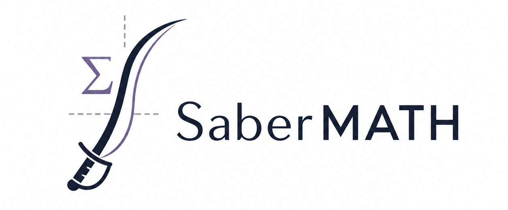

<div align="center">
  
</div>

# SABER-Math

SABER-Math (**S**calable **A**utomated **B**enchmark for **E**valuation of **R**etrieval in **Math**) is a benchmark for evaluating information retrieval systems on mathematics. It is designed to test whether a retriever can find solved problems that are mathematically useful for a query problem, rather than only textually similar.

The benchmark focuses on informal mathematical retrieval over high-school, olympiad, and early-undergraduate-style problems. Each query is paired with a fixed set of candidate documents, and every candidate has a fine-grained relevance score. The main evaluation setting is **statement-full**: the query contains only the problem statement, while each retrieved document contains a problem statement together with its solution.

SABER-Math was built from a large problem-solution corpus using an automated pipeline. Candidate pairs are first discovered using two complementary signals: overlap in mathematical ontology topics and lexical overlap between short solution-idea summaries. Final relevance scores are then assigned with pairwise LLM judgments, aggregated with a Bradley-Terry model after a Swiss-style tournament. The released package evaluates retrievers with nDCG@10 across the full benchmark and across five mathematical domains: Algebra, Geometry, Number Theory, Combinatorics, and Calculus and Analysis.

## Installation

SABER-Math requires Python 3.10 or newer. Python 3.11 or newer is recommended.

```bash
git clone <repo-url>
cd sabermath

python -m venv .venv
source .venv/bin/activate
python -m pip install --upgrade pip
python -m pip install -e .
```

Optional extras are available for different retriever backends:

```bash
# vLLM-backed embedding models
python -m pip install -e ".[vllm]"

# OpenAI and Gemini embedding APIs
python -m pip install -e ".[apis]"

# Classical / legacy baselines: TF-IDF, BM25, Jaccard, Approach Zero
python -m pip install -e ".[legacy]"

# Everything
python -m pip install -e ".[vllm,apis,legacy]"
```

For API-based models, set the relevant API key before running evaluation:

```bash
export OPENAI_API_KEY=<your-openai-api-key>
export GEMINI_API_KEY=<your-gemini-api-key>
# GOOGLE_API_KEY is also supported for Gemini.
```

## Running the benchmark

The package exposes a simple Python API through `sabermath.evaluate`. By default, it loads the benchmark datasets from Hugging Face:

- `sabermath/SaberMath-queries`
- `sabermath/SaberMath-documents`

### Python API

```python
import json
import sabermath

report = sabermath.evaluate(
    "BAAI/bge-m3",
    tasks=["statement-full"],
    k=10,
    dcg_variant="exponent",
)

print(report)
print(json.dumps(report.to_dict(), indent=2))
```

The available tasks are:

| Task | Query text | Document text |
|---|---|---|
| `statement-statement` | problem statement | problem statement |
| `statement-full` | problem statement | problem statement + solution |
| `full-full` | problem statement + solution | problem statement + solution |

If `tasks` is omitted, all three tasks are evaluated. The returned report contains the overall nDCG@k score and per-domain scores for Algebra, Geometry, Number Theory, Combinatorics, and Calculus and Analysis. The default value of `k` is `10`.

### Command-line runner

The `scripts/run_model.py` script provides a convenient way to evaluate supported retrievers and save the results as JSON files.

```bash
python scripts/run_model.py BAAI/bge-m3 \
  --driver st \
  --save-to results \
  --cache
```

For vLLM-backed models, use `--driver vllm`:

```bash
python scripts/run_model.py Qwen/Qwen3-Embedding-8B \
  --driver vllm \
  --save-to results \
  --cache
```

The runner also supports API models and classical baselines:

```bash
python scripts/run_model.py google/gemini-embedding-001 --save-to results --cache
python scripts/run_model.py openai/text-embedding-3-large --save-to results --cache
python scripts/run_model.py bm25 --save-to results
```

Accepted model names include Hugging Face model IDs, `google/<model>`, `openai/<model>`, `bm25`, `tf-idf`, `approach0`, and `jaccard`. Note: `approach0` is only supported on Linux systems.

## `build_benchmark/`: recreating the benchmark

The `build_benchmark/` directory contains the code for recreating SABER-Math from the raw problem-solution databank. You do **not** need this directory to run the released benchmark; it is for reproducing the benchmark construction pipeline.

The directory has its own `README.md` with the full step-by-step instructions. At a high level, the pipeline has two phases:

1. **Select targets and candidates.** Problems are annotated with mathematical ontology tags and short solution ideas. Pairwise topic similarity and solution-summary Jaccard similarity are computed at scale, then target queries and candidate sets are selected.
2. **Assign relevance scores.** Candidate documents are compared with an LLM judge in a Swiss-style tournament. The pairwise outcomes are converted into continuous relevance scores with a Bradley-Terry model, and the final scores are scaled to the benchmark rating range.

Important subdirectories:

| Path | Purpose |
|---|---|
| `build_benchmark/annotate/` | LLM-based tag extraction, solution-idea extraction, and postprocessing. |
| `build_benchmark/similarities/` | Topic-similarity and solution-summary similarity computation. |
| `build_benchmark/fastbma/` | C extension for faster Best-Match Average topic similarity. |
| `build_benchmark/select/` | Target and candidate selection scripts. |
| `build_benchmark/generate_scores/` | Swiss tournament judging and Bradley-Terry relevance scoring. |
| `build_benchmark/final_transform.py` | Final score transformation before publishing the benchmark dataset. |

See `build_benchmark/README.md` for the exact environment variables, commands, Hugging Face dataset paths, and configuration files.

## `experiments/`: paper analyses and supporting experiments

The `experiments/` directory contains the scripts used for the paper analyses and supporting experiments. It is mainly intended for reproducing figures, tables, and additional analyses from the SABER-Math paper.

The `experiments/README.md` file maps each analysis to its corresponding directory and explains the expected inputs for the scripts. The main experiment locations are:

| Location | Experiment stored there |
|---|---|
| `experiments/bechmark_analysis/` | Benchmark and source-corpus composition analysis, including domain and subdomain distribution plots. |
| `experiments/additional_experiments/` | Extra construction-pipeline analyses, including Swiss-tournament inversion studies and the effect of topic-only, solution-only, and combined candidate-selection signals. |
| `experiments/math-vs-word/` | Experiments comparing whether retrievers rely more on mathematical notation or surrounding natural-language text. |
| `experiments/confidence_intervals/` | Bootstrap confidence intervals for retrieval results and scripts for formatting them into LaTeX tables. |
| `experiments/mteb_comparison/` | Correlation analysis between SABER-Math performance and general-purpose MTEB retrieval scores. |

Most experiment scripts assume that the required datasets, vector caches, or intermediate JSON/CSV files already exist at the paths specified in the local config files or command-line arguments. For detailed commands and file-level explanations, see the README files inside `experiments/` and its subdirectories.

## License

This project is licensed under the Creative Commons Attribution-ShareAlike 4.0 International License (CC BY-SA 4.0).

You are free to share and adapt the material, provided that appropriate credit is given and any derivative works are distributed under the same license.